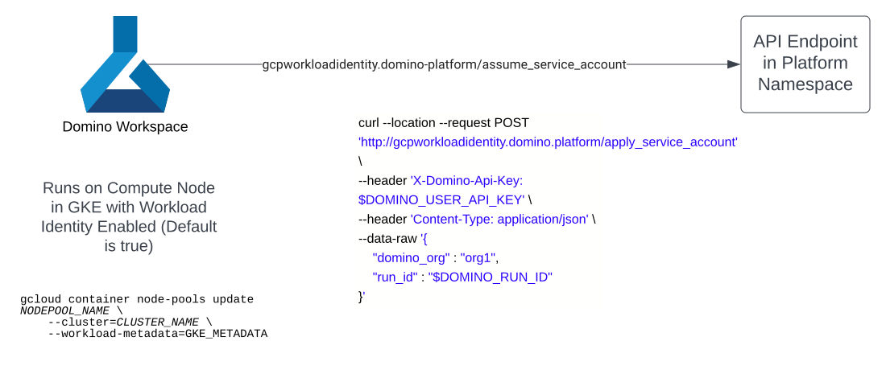
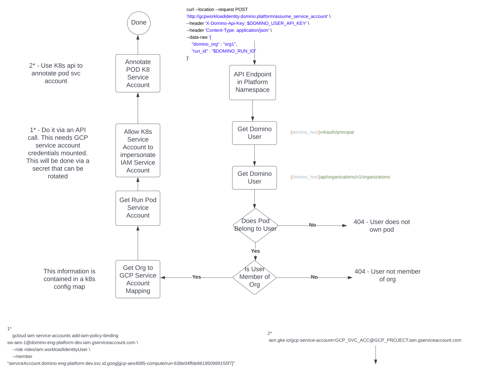

# Enable Workload identities for Workspace Pod

The goal of this service which is meant to be deployed in the `domino-platform` namespace is to allow a workspace or job
run to assume a [workload identity](https://cloud.google.com/kubernetes-engine/docs/how-to/workload-identity#gcloud_4).

The process is as follows:

1. The Domino administrator create one or more organizations in Domino
2. The Domino Administrator adds Domino users to zero or more organizations (defined in 1)
3. The kubernetes admin creates a config-map object in k8s in the `domino-platform` namespace
   which maintains a 1-1 mapping between the Org's defined in (1) to a corresponding GCP Service Account Email (not the whole JSON Key)
4. From inside the workspace the user makes an API call below-
```shell
curl --location --request POST 'http://gcpworkloadidentity.domino.platform/assume_service_account' \
--header 'X-Domino-Api-Key: $DOMINO_USER_API_KEY' \
--header 'Content-Type: application/json' \
--data-raw '{    
    "domino_org" : "org1",
    "run_id" : "$DOMINO_RUN_ID"
}'
```
5. If the user is a member of the `org1` the pod assumes the service account identity. They can use the google cloud
python api or `gcloud` commands under that identity. This can be confirmed by running the following commands-
```shell
    prompt> curl -H "Metadata-Flavor: Google" http://169.254.169.254/computeMetadata/v1/instance/service-accounts/default/email
    #Outputs the service account email
    prompt> sw-svc-gcp@domino-eng-platform-dev.iam.gserviceaccount.com
 ```

```shell
    prompt> curl -H "Metadata-Flavor: Google" http://169.254.169.254/computeMetadata/v1/instance/service-accounts/default/token
    #Outputs the token
    prompt> {"access_token":"ya29.c.b0Aa9VdykuAgnkfrznBe4uDue9BLH......","expires_in":3599,"token_type":"Bearer"}
 ```

An important security feature of this implementation is that, the access keys obtained in the last call
```shell
curl -H "Metadata-Flavor: Google" http://169.254.169.254/computeMetadata/v1/instance/service-accounts/default/token
```
**_is only usable from inside the GKE cluster where the workspace is running._**

### High Level Design

The pre-requisite for this system to work is to have Workload Identity enabled on the GKE nodepool which hosts the
compute nodes


```shell
gcloud container node-pools update NODEPOOL_NAME \
    --cluster=CLUSTER_NAME \
    --workload-metadata=GKE_METADATA
```

 

In addition to `assume_service_account` endpoint, additional endpoints are provided - 

1. `reset_service_account` - this call removes the service account attached to the Domino run pod
2. `get_my_orgs` - This is a helper call for the user to get all the Domino organization they belong to

### Sequence Diagram

  

The high level checks are -

1. Does the user own the run pod? 
2. Does the user belong to the org that they claim to belong to?

The service is mounted with a GCP service account key in the folder /etc/keys/gcp.json

The Service now determines the follows-

1. What is the service account attached to the run pod? This is obtained using the `run_id` passed and the pod definition.
2. What is the GCP service account attached to the Domino org? This is obtained from the config map `domino-org-gcp-svc-account-mapping` in the 
`domino-platform` namespace.
   
For the same of this document assume that there are three orgs and three gcp service accounts

|Domino Org | GCP Service Account |
| ---       | ----------- |
|org1       | aes1-svc@domino-eng-platform-dev.iam.gserviceaccount.com
|org2       | aes2-svc@domino-eng-platform-dev.iam.gserviceaccount.com
|org3       | aes3-svc@domino-eng-platform-dev.iam.gserviceaccount.com

The ConfigMap definition is as follows:
```yaml
apiVersion: v1
kind: ConfigMap
metadata:
  name: domino-org-gcp-svc-account-mapping
  namespace: gcp-aes4085-platform
data:
  org1: sw-aes-1@domino-eng-platform-dev.iam.gserviceaccount.com
  org2: sw-aes-2@domino-eng-platform-dev.iam.gserviceaccount.com
  org3: sw-aes-3@domino-eng-platform-dev.iam.gserviceaccount.com

```

Now assume that a user `u1` belongs to all the three orgs

If this user starts a workspace and that workspace has the run-id `run-1234` and from inside the workspace the user 
makes the following api call-
```
curl --location --request POST 'http://gcpworkloadidentity.domino.platform/assume_service_account' \
--header 'X-Domino-Api-Key: $DOMINO_USER_API_KEY' \
--header 'Content-Type: application/json' \
--data-raw '{    
    "domino_org" : "org1",
    "run_id" : "$DOMINO_RUN_ID"
}
```
The backend service will determine that the K8s service account for this domino run is `run-1234` or $DOMINO_RUN_ID

Next it will make the equivalent of the following gcloud api call using the GCP service account key mounted in the file `/etc/keys/gcp.json`

```shell
  gcloud iam service-accounts add-iam-policy-binding aes1-svc@domino-eng-platform-dev.iam.gserviceaccount.com \
    --role roles/iam.workloadIdentityUser \
    --member "serviceAccount:domino-eng-platform-dev.svc.id.goog[domino-compute/run-1234]"
```

This call allows the Kubernetes service account to impersonate the IAM service account by adding an IAM policy binding 
between the two service accounts. This binding allows the Kubernetes service account to act as the 
IAM service account. 

**This call can only be made on an existing K8s service account. No wild cards are allowed which would open a security risk**

This service should periodically poll for service account mappings that are no longer valid or when a pod is destroyed to make the following vcall


```shell
gcloud iam service-accounts remove-iam-policy-binding aes1-svc@domino-eng-platform-dev.iam.gserviceaccount.com \
    --role roles/iam.workloadIdentityUser \
    --member "serviceAccount:domino-eng-platform-dev.svc.id.goog[domino-compute/run-1234]"
```

This can be done with pod lifecycle hooks or with periodic polling of the `iam-policy-binding` for each of the GCP service accounts to which POD are attached to

**Each of the access tokens are only valid for 60 mins. Not making the cleanup call does not significantly affect the 
security posture of this implementation becaude making the call may still end up needing 30 mins to revoke the access token.
It is a good practice to clean up nonetheless**


Finally the service adds the following annotation to the pod service account `run-1234`

```
 iam.gke.io/gcp-service-account=aes1-svc@domino-eng-platform-dev.iam.gserviceaccount.com
```

It then stores the current mapping for this Domino user `u1` in the config-map `domino-user-current-org-mapping` of the 
`domino-platform` namespace. This allows a pre-run script to make the following call-

```shell
curl --location --request POST 'http://gcpworkloadidentity.domino.platform/assume_service_account' \
--header 'X-Domino-Api-Key: $DOMINO_USER_API_KEY' \
--header 'Content-Type: application/json' \
--data-raw '{    
    "domino_org" : "",
    "run_id" : "$DOMINO_RUN_ID"
}'
```
If the `domino-org` parameter is empty, the mapping is made between the first org mapped to user in the `domino-user-current-org-mapping`
if the org to user mapping is still valid. If the mapping does not exist, the call returns with a 404 status code without any mapping configured

Once he call `assume_service_account` succeeds the user can confirm that the GCP service account is assumed by running 
the following commands in a terminal

```shell
    prompt> curl -H "Metadata-Flavor: Google" http://169.254.169.254/computeMetadata/v1/instance/service-accounts/default/email
    #Outputs the service account email
    prompt> sw-svc-gcp@domino-eng-platform-dev.iam.gserviceaccount.com
 ```

```shell
    prompt> curl -H "Metadata-Flavor: Google" http://169.254.169.254/computeMetadata/v1/instance/service-accounts/default/token
    #Outputs the token
    prompt> {"access_token":"ya29
```

From inside a python shell the user will authenticate by calling the following lines:

```shell
pip install google.cloud

```
```python

import google.auth
creds, project = google.auth.default()
print(project) #This prints the GCP project
print(creds.token) #This should be None
import google.auth.transport.requests
auth_req = google.auth.transport.requests.Request()
creds.refresh(auth_req)
print(creds.token) #Now you are authenticated using the serivce account..
print(creds.token)
print(creds.service_account_email)

```

## Installation

1. First build the image. The default values for the image repository and tag are
```shell
tag="${tag:-latest}"
operator_image="${operator_image:-quay.io/domino/gcpworkloadidentity}"
```

```shell
./create_and_push_docker_image.sh
```
This create the image `quay.io/domino/gcpworkloadidentity` with tag `latest`

2. Next install the service

Again you have the following defaults. Change appropriately for dev testing as your namespaces
may not be the default. Also note the image url
```shell
image="${image:-quay.io/domino/gcpworkloadidentity}"
platform_namespace="${platform_namespace:-domino-platform}"
compute_namespace="${platform_namespace:-domino-compute}"
```
My values are
```shell
image="${image:-quay.io/domino/gcpworkloadidentity}"
platform_namespace=gcp-aes4085-platform
compute_namespace="gcp-aes4085-compute
```

Next fetch the GCP Project Id, Region and GKE Id for the kubernetes cluster and run the install script 

```shell
 ./scripts/deploy.sh $tag $gcp_project_id $gcp_project_location $gke_id
```
My sample values are-
```shell
 ./scripts/deploy.sh latest domino-eng-platform-dev us-west1 gcp-aes4085
```

3. Map your k8s service account for the `gcpworkloadidentity` service to the workload identity

The pre-requisite here is that you should have a service account with `get-iam-role` and `set-iam-role` permissions

Mine is `gcp-aes4085-gcr@domino-eng-platform-dev.iam.gserviceaccount.com` which was the service
account created for my GKE cluster where domino is installed. These policies had to be attached to the service
account after the cluster was created.

Go to a cloud shell with the role required to get and set iam roles and run the following commands
and kubectl access to the cluster.


```shell
gcloud iam service-accounts add-iam-policy-binding ${GCP_MASTER_SVC_ACCOUNT}  --project $gcp_project_id --role roles/iam.workloadIdentityUser --member "serviceAccount:${GCP_PROJECT_ID}.svc.id.goog[${platform_namespace}/gcpworkloadidentity]" \
          --condition condition="expression=request.auth.claims.google.providerId=='https://container.googleapis.com/v1/projects/domino-eng-platform-dev/locations/${GCP_PROJECT_LOCATION}/clusters/${GCP_GKE_ID}',description=single-cluster-acl,title=single-cluster-acl" 
kubectl annotate serviceaccount gcpworkloadidentity --namespace ${platform_namespace}   iam.gke.io/gcp-service-account=${GCP_MASTER_SVC_ACCOUNT} \

```
For example:

```shell
gcloud iam service-accounts add-iam-policy-binding gcp-aes4085-gcr@domino-eng-platform-dev.iam.gserviceaccount.com     --role roles/iam.workloadIdentityUser     --member "serviceAccount:domino-eng-platform-dev.svc.id.goog[gcp-aes4085-platform/gcpworkloadidentity]" \
gcloud iam service-accounts add-iam-policy-binding gcp-aes4085-gcr@domino-eng-platform-dev.iam.gserviceaccount.com     --role roles/iam.workloadIdentityUser     --member "serviceAccount:domino-eng-platform-dev.svc.id.goog[stevel5060-platform/gcpworkloadidentity]" \
```

This ensures that the service ${platform_namespace}/gcpworkloadidentity runs as the GCP Service Account with permissions to map 
POD Service Accounts to other service accounts

4. Map the orgs to the three service accounts above-

The file is `./config/mapping.yaml` (Change the mappings based on your values of orgs and gcp service accounts)
```yaml
apiVersion: v1
kind: ConfigMap
metadata:
  name: domino-org-gcp-svc-account-mapping
data:
  org1: sw-aes-1@domino-eng-platform-dev.iam.gserviceaccount.com
  org2: sw-aes-2@domino-eng-platform-dev.iam.gserviceaccount.com
  org3: sw-aes-3@domino-eng-platform-dev.iam.gserviceaccount.com
```

and recreate the configmap

```shell
kubectl delete -f ./config/mapping.yaml -n ${platform_namespace}
kubectl create -f ./config/mapping.yaml -n ${platform_namespace}
```

Alternatively, a Domino Administrator can invoke an endpoint `/map_org_to_gcp_sa` with a payload
{    
    "domino_org" : "<DOMINO_ORG>",
    "gcp_sa" : "<GCP_SA>"
}
If the call is successful, it will return the response -
```shell
Domino Org <DOMINO_ORG> mapping updated from GCP SA <PREVIOUS_GCP_SA> to
<NEW_GCP_SA>
```

Ex. 
```shell
curl --location --request POST 'http://gcpworkloadidentity-svc.stevel5060-platform/map_org_to_gcp_sa' \
--header 'X-Domino-Api-Key: '"$DOMINO_USER_API_KEY"'' \
--header 'Content-Type: application/json' --data-raw '{ "domino_org" : "'"$DOMINO_ORG"'",  "gcp_sa" : "'"GCP_SA"'"}'
```

When I make the call with the following payload -
```json
{    
    "domino_org" : "org3",
    "gcp_sa" : "sw-aes-2@domino-eng-platform-dev.iam.gserviceaccount.com"
} 
```

It returns the response 
```shell
Domino Org org3 mapping updated from GCP SA sw-aes-3@domino-eng-platform-dev.iam.gserviceaccount.com to
sw-aes-2@domino-eng-platform-dev.iam.gserviceaccount.com
```


5. Map the orgs to the three service accounts above

## Environment Definition

Example Dockerfile instructions for the new environment are-

```
RUN sudo apt-get install apt-transport-https ca-certificates gnupg -y
RUN sudo apt-get install apt-transport-https ca-certificates gnupg -y
RUN sudo apt autoremove -y
RUN curl https://packages.cloud.google.com/apt/doc/apt-key.gpg | sudo apt-key --keyring /usr/share/keyrings/cloud.google.gpg add -
RUN echo "deb [signed-by=/usr/share/keyrings/cloud.google.gpg] https://packages.cloud.google.com/apt cloud-sdk main" | sudo tee -a /etc/apt/sources.list.d/google-cloud-sdk.list
RUN sudo apt-get update && sudo apt-get install google-cloud-cli -y
RUN pip install google.cloud
RUN pip install google.auth
USER 1001
```
## Start a Workspace 
Now start a workspace by a user who belongs to the `org1` Domino organization using the new environment and 
run the following lines of code in the notebook cell

```python
import requests

import os
org = 'org1'
url = 'http://gcpworkloadidentity-svc.gcp-aes4085-platform/assume_service_account'
headers = {"Content-Type" : "application/json",
           "X-Domino-Api-Key": os.environ['DOMINO_USER_API_KEY'] 
          }
print(headers)
data = {
    "domino_org" : org,
    "run_id" : os.environ['DOMINO_RUN_ID']
}

resp = requests.post(url,headers=headers,json=data)
print(resp.status_code)
print(resp.content)
```

You should see the following output:
```shell
{'Content-Type': 'application/json', 'X-Domino-Api-Key': '49fe95b5e93d150d51da51b33081965dd5e8951285d4174d68a6931ae4b191f8'}
200
b'User now assumes the GCP Service Account sw-aes-1@domino-eng-platform-dev.iam.gserviceaccount.com'
```
You pod has not assumed the GCP service account identity `sw-aes-1@domino-eng-platform-dev.iam.gserviceaccount.com'`

You can fetch the access keys as follows from the terminal

```shell
    curl -H "Metadata-Flavor: Google" http://169.254.169.254/computeMetadata/v1/instance/service-accounts/default/email
 ```

```shell
    curl -H "Metadata-Flavor: Google" http://169.254.169.254/computeMetadata/v1/instance/service-accounts/default/token
```

**Note that it may take a few seconds before the token is available**

6. You can change the service account as follows:

5. Now map the orgs to the three service accounts above-

Now start a workspace by a user who belongs to the `org1` Domino organization run the following lines
of code in the notebook cell

```python
import requests

import os
org = 'org1'
url = 'http://gcpworkloadidentity-svc.gcp-aes4085-platform/assume_service_account'
headers = {"Content-Type" : "application/json",
           "X-Domino-Api-Key": os.environ['DOMINO_USER_API_KEY'] 
          }
data = {
    "domino_org" : org,
    "run_id" : os.environ['DOMINO_RUN_ID']
}

resp = requests.post(url,headers=headers,json=data)
print(resp.status_code)
print(resp.content)
```

You should see the following output:
```shell
200
b'User now assumes the GCP Service Account sw-aes-1@domino-eng-platform-dev.iam.gserviceaccount.com'
```


6. Change to `org2` if you are a member as follows:

```python
import requests

import os
org = 'org2'
url = 'http://gcpworkloadidentity-svc.gcp-aes4085-platform/assume_service_account'
headers = {"Content-Type" : "application/json",
           "X-Domino-Api-Key": os.environ['DOMINO_USER_API_KEY'] 
          }
data = {
    "domino_org" : org,
    "run_id" : os.environ['DOMINO_RUN_ID']
}

resp = requests.post(url,headers=headers,json=data)
print(resp.status_code)
print(resp.content)
```

You should see the following output:
```shell
200
b'User now assumes the GCP Service Account sw-aes-2@domino-eng-platform-dev.iam.gserviceaccount.com'
```


## Assuming a default GCP service account when a workspace starts up

Add the following line to your pre-run script for the environment-
```shell
curl --location --request POST 'http://gcpworkloadidentity-svc.domino-platform/assume_service_account' --header 'X-Domino-Api-Key: '"$DOMINO_USER_API_KEY"'' --header 'Content-Type: application/json' --data-raw '{ "run_id" : "'"$DOMINO_RUN_ID"'"}'
```

If the user has assumed an identity in a previous session, it is saved. The same org the user used in the previous session will be used as the default for the current workspace session

## What is the GCP_ACCESS_KEY is copied from the workspace and used outside of it

The GCP Service Account token generated is a conditional one. It can only be used inside the GKE cluster.

The only risk is from an internal rogue user, who finds a way to get the key, creates pod manually in the GKE 
cluster and use the key inside that pod. Such a user has privileges which should not be given to a normal user.

If the access token is used from outside the GKE cluster, it will not work.


## Improving the traceebility of each GCP token

Determine a way to tag the access keys generated inside the workspace with tags identifying the user. 
This will help traceability when the key is compromised. However, as noted in the previous section, the GCP access keys can
only be used from inside the GKE cluster.

## Removing the GSA Mappings when the workspace or job finishes

Adding a pre-stop hook - https://kubernetes.io/docs/tasks/configure-pod-container/attach-handler-lifecycle-event/
to invoke the endpoint  `reset_service_account` would pre-emptively remove mappings between pod service accounts and gcp service accounts

```shell
import requests

import os
org = 'org1'
url = 'http://gcpworkloadidentity-svc.gcp-aes4085-platform/reset_service_account'
headers = {"Content-Type" : "application/json",
           "X-Domino-Api-Key": os.environ['DOMINO_USER_API_KEY'] 
          }
print(headers)
data = {
    "run_id" : os.environ['DOMINO_RUN_ID']
}

resp = requests.delete(url,headers=headers,json=data)
print(resp.status_code)
print(resp.content)
```

Such a hook can be added via `domsed`

## Support Questions

1. If workload identity turned on for the platform nodes?
2. Is the domino service deployed in this project running?
3. Is the GCP Service Account mapped to the domino service have the requisite permissions to map the pod service accounts to the appropriate service account?
4. Are the orgs mapped to the correct GCP service accounts which exist?
5. Is the user a member of the org, mapped to the GCP service account the user is requesting?
6. What do the following commands return-
```shell
    prompt> curl -H "Metadata-Flavor: Google" http://169.254.169.254/computeMetadata/v1/instance/service-accounts/default/email
    #Outputs the service account email
    prompt> sw-svc-gcp@domino-eng-platform-dev.iam.gserviceaccount.com
 ```

```shell
    prompt> curl -H "Metadata-Flavor: Google" http://169.254.169.254/computeMetadata/v1/instance/service-accounts/default/token
    #Outputs the token
    prompt> {"access_token":"ya29
```
